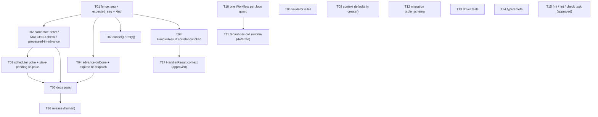

<!--
GENERATED ANALYSIS — @marianmeres/workflow
Produced 2026-08-26 by an inline single-agent review: full read of src/, tests/, docs, and the
resolved sources of @marianmeres/fsm 3.1.0, steve 3.0.0, cron 3.2.0 → self-verification pass
re-opening every cited line → synthesis. Claims verified against the codebase at commit 02a7635.
Planning artifact; no code was changed.
-->

# @marianmeres/workflow — Analysis Overview & Roadmap

> **Overall verdict: the architecture is right and the code is clean; nothing needs
> rethinking.** The three-layer model (definition / instance / driver), the two-column
> state (`cursor` + `execution_state`), pure-data definitions with string handler
> references, pin-and-freeze versioning, the `meta`-driven dispatch over fsm 3.1's
> `fromSnapshot`, the append-only history, and the migration ledger are all sound and
> should stay exactly as they are. The four dimension docs found no design-level problem.

> **The one systemic gap: the driver assumes exactly-once job delivery; steve delivers
> at-least-once and never retries a crashed job.** There is no fencing token, so a
> duplicate or stale job is not ignored — it is applied: a stale outcome is rejected by the
> FSM and marks a healthy instance `failed`, a replayed initial advance dispatches the same
> effect twice, and an `expired` effect job from a step the instance already left marks it
> `failed`. The scheduler's claim-then-enqueue and `create()`'s insert-then-enqueue leave
> rows `pending` with no job if the process dies in between; `workflow.advance` failures
> are never observed. For a package whose reason to exist is "survive restarts and sleep
> for days," this is the thing to fix first — and one mechanism (a per-instance `seq`
> carried as `expected_seq` on every job, with ticks reduced to idempotent pokes) closes
> all of it. Detail: [`01-durability.md`](./01-durability.md).

> **The bug you will most likely hit first in practice: signals that arrive early are
> thrown away, and a signal landing on a timer-only wait fails the instance.** The
> correlator only looks for `waiting` instances and consumes every inbox row it examines,
> so a supplier reply that arrives while `send_order` is still running — or during any
> delay node — is marked processed and lost; the instance then waits out its full timeout.
> Replies arrive whenever they like; the fix is to defer instead of drop, deliver only to
> nodes that accept `MATCHED`, and mark the inbox row processed inside the advance
> transaction. Detail: [`02-correlation.md`](./02-correlation.md).

> **The rest is edges and honesty.** The docs promise exactly the guarantees the driver
> lacks (a single transaction with the job insert; "steve retries" — it marks `expired`;
> and `autoCleanup`, the switch that makes any crash recovery happen, is never mentioned).
> There is no `cancel()` or `retry()`. The validator accepts definitions that must fail at
> runtime. `create()` ignores the definition's `context` defaults. Two `Workflow`s on one
> `Jobs` silently overwrite each other. Detail: [`03-definition-and-api.md`](./03-definition-and-api.md),
> [`04-docs-tests-ops.md`](./04-docs-tests-ops.md).

> **How to read `docs/analysis/`.** This file is the map. Read `01-durability.md` first —
> its #1 (the fence) is the foundation every other durability change and the correlator
> redesign build on — then `02-correlation.md`, then `03` and `04` in any order. Each doc
> has a ranked summary, findings with `file:line` evidence and a **Done when** line, and an
> "Open questions" section; [`PROGRESS.md`](./PROGRESS.md) is the tracker and the decisions
> log.

---

## Top recommendations across all dimensions (ranked)

Ranked by impact on "this package is about to run real workflows" × feasibility for a solo
maintainer. Effort: S = small, M = medium.

| Rank | Recommendation                                                                                                      | Dimension (doc)         | Value | Effort | Risk | Why now                                                                                                                         |
| ---- | ------------------------------------------------------------------------------------------------------------------- | ----------------------- | ----- | ------ | ---- | ------------------------------------------------------------------------------------------------------------------------------- |
| 1    | Fencing token `seq` on instances; `expected_seq` + `kind` on every advance; fenced `runEffect` / `failEffectJob`    | durability (01 #1)      | high  | M      | med  | Every duplicate/stale job today corrupts an instance; every other durability fix needs this. Migration is additive, shimmed.    |
| 2    | Correlator: defer early signals, deliver only to `MATCHED`-accepting waits, processed-in-advance, same-tick dedupe  | correlation (02 #1, #2) | high  | M      | low  | Realistic data loss in the primary use case (email replies). Needs #1 for the fenced poke.                                      |
| 3    | Observe `workflow.advance` failures; bounded re-dispatch of `expired` jobs; `advanceMaxAttempts`                    | durability (01 #3)      | high  | S      | low  | Today a throwing guard or a 10 s DB blip strands an instance silently; a crashed worker fails it (or strands it forever).       |
| 4    | Scheduler tick becomes a read-only poke; stale-`pending` re-poke; `create()` in a transaction                       | durability (01 #2)      | high  | S–M    | low  | Closes the two "pending with no job, forever" crash windows. Safe only after #1 and #2 (see sequencing).                        |
| 5    | Docs: correct the three durability over-claims, document `autoCleanup`, the fence/poke model, signal semantics      | docs (04 #1)            | high  | S      | low  | The current text tells consumers not to add safety nets the code needs. Do last in the sprint so it describes shipped behavior. |
| 6    | `cancel()` / `retry()` admin API                                                                                    | durability (01 #4)      | med   | S      | low  | First thing an operator asks for; the constants and terminal checks already exist. Needs #1.                                    |
| 7    | Validator: reject definitions that must fail at runtime (`pure` without `ENTER`, `timeoutSec` without `TIMEOUT`, …) | definition (03 #1)      | med   | S      | low  | Turns a deterministic runtime `failed` into a construction-time error.                                                          |
| 8    | `create()` seeds context from `def.fsm.context`                                                                     | definition (03 #2)      | med   | S      | low  | Definitions declaring defaults are silently ignored today.                                                                      |
| 9    | `HandlerResult.correlationToken` — set the token from the effect that produced it                                   | correlation (02 #3)     | med   | S      | low  | `Message-ID` threading and provider session ids are impossible with a create-time-only token. Needs #1's payload shape.         |
| 10   | Guard: one `Workflow` per `Jobs` (+ `detach()`)                                                                     | definition (03 #3a)     | med   | S      | low  | Silent handler overwrite; a WeakMap and one throw.                                                                              |
| 11   | Migration 1.1.0 guard: `table_schema = current_schema()`                                                            | ops (04 #2)             | med   | S      | low  | Wrong result in multi-schema databases; one line.                                                                               |
| 12   | Driver tests: pure routing, hop guard, rejection paths, matcher rejection; shared `waitUntil`                       | tests (04 #3)           | med   | M      | low  | The untested branches are the ones the sprint touches.                                                                          |
| 13   | Tenant-per-call runtime (one `Workflow` serves many tenants; `"*"` ticks) — **deferred 2026-08-26**                 | definition (03 #3b)     | med   | M      | med  | Guard only (T10) for now; revisit when several tenants must share one `Workflow`/`Jobs` in one process.                         |
| 14   | Opt-in `HandlerResult.context` patch — **approved 2026-08-26**                                                      | definition (03 #4)      | med   | S      | low  | Removes the per-edge `action` boilerplate; explicit per handler; `data` stays the fsm payload.                                  |
| 15   | Typed `meta` (`WorkflowFSMConfig`)                                                                                  | definition (03 #5)      | low   | S      | low  | Editor feedback only; kept because it is trivially cheap.                                                                       |
| 16   | `deno fmt` / `deno lint` clean + `deno task check`                                                                  | ops (04 #4)             | low   | S      | low  | Red baseline blocks using them as `Verify:` commands. Markdown reflow is the owner's call.                                      |

Deliberately **omitted** as low-value at the stated scale or out of scope: inbox/history
retention purge (revisit when the tables grow), snapshot-into-instance (deferred by the
design brief itself), a "latest registered version" resolver for `create()`, a
transactional `Jobs.create` in steve (unnecessary once the fence exists — the at-least-once
model is fine when duplicates are no-ops), a partial unique index on waiting
`correlation_token`s (would turn a definition mistake into a failed advance instead of a
matcher decision), and the fsm debug lines emitted per advance (filterable).

---

## Recommended first sprint (do these 5 first)

**1. Fencing token (Rank 1 — `01-durability.md` #1).** First because everything else in
the sprint stands on it. Migration `1.2.0` adds `seq integer NOT NULL DEFAULT 0` to
`__workflow_instances`; every settle-point write in `runAdvance` bumps it; every advance
payload carries `kind` (`start` / `effect` / `timeout` / `signal`) and `expected_seq`;
every effect payload carries `seq`. `runAdvance` no-ops (debug log, no history) when the
row's `seq` differs or the kind's precondition fails (`start` needs `pending`, `effect`
needs `running`, `timeout`/`signal` need `waiting`); `runEffect` skips the handler on a
stale `seq`; `failEffectJob` ignores stale jobs. `create()` moves inside a transaction.
Jobs queued by 2.0.x (no `expected_seq`) are treated as unfenced — a shim in the same
spirit as `payloadTenantId`, removed together. Scope: one migration, `types.ts`,
`driver.ts`, `workflow.ts`, payload call sites in scheduler/correlator, a new
`tests/durability.test.ts`.

**2. Correlator semantics (Rank 2 — `02-correlation.md` #1, #2).** Second because it is
the first bug real traffic will produce, and its fenced poke needs Rank 1. Look the token
up among _live_ instances; defer (leave unprocessed) when the instance is not yet
`waiting` or its node has no `MATCHED` edge; mark processed only for unknown/terminal
tokens or a matcher `false`; on matcher `true` enqueue `{ kind: "signal", inbox_id,
expected_seq }` and let the advance apply `MATCHED` and mark the inbox row processed in
its own transaction; per-tick dedupe by instance; a throwing matcher leaves the row for
the next tick. Delete the correlator's instance `UPDATE`.

**3. Scheduler poke + stale-`pending` re-poke (Rank 4 — `01-durability.md` #2).** After
Rank 2, because the stale-`pending` re-poke is only safe once `create()` is the sole
producer of `pending`. The tick becomes two `SELECT`s and a loop of fenced pokes; the
advance re-validates `waiting && wake_at <= now()` under the lock and clears `wake_at`
itself. `claimDueWakeUps` is deleted; a partial index for the `pending` scan rides in
migration `1.2.0`.

**4. Job-failure observation (Rank 3 — `01-durability.md` #3).** Independent of 2 and 3,
needs only Rank 1. `onDone(JOB_TYPE_ADVANCE)`: `failed` → instance `failed` with the
attempt's error message; `expired` → re-dispatch the identical payload, bounded by
`redispatchLimit` (3). Effect types: `expired` → same bounded re-dispatch instead of
failing. New `advanceMaxAttempts` (10). This is what turns "steve marks it expired" into
recovery.

**5. Docs pass (Rank 5 — `04-docs-tests-ops.md` #1).** Last, so it documents what shipped:
the at-least-once/fenced model, the poke ticks, the signal deferral rules, `autoCleanup:
true` in the README example, the new options, and the cron/steve noop-handler hazards.

> Sequencing: T01 → T02 → T03; T01 → T04; all four → T05. Rank 6 (`cancel`/`retry`) is the
> natural first backlog pick — it is small and its safety comes from Rank 1.

---

## Cross-cutting themes

- **Exactly-once assumed, at-least-once delivered.** The comment at `workflow.ts:152–154`
  ("the advance is idempotent (cursor-aware)") is the single assumption behind 01 #1, #2,
  #3 and the "retries" wording in 04 #1. Steve is honest about its model
  (`_mark-expired.ts:6–8`); the driver just has no way to tell a fresh job from a stale
  one. The fence is the one primitive that makes every other fix a local change.

- **"The advance is the only writer."** After the sprint, ticks never mutate instance
  rows; `runAdvance` (and `cancel`/`retry`) do, under `FOR UPDATE`, bumping `seq`. That
  invariant is why duplicate pokes are harmless, why the correlator no longer needs its
  `pending` flip, and why the inbox row can be marked processed atomically with the
  transition. It is worth stating in `AGENTS.md` as convention #8.

- **Signals are events, not requests.** They arrive whenever they like — before the wait,
  during a delay, twice in a minute, after completion. 02 #1/#2 and 03 #1 (the validator's
  `matcher ⇒ MATCHED` rule) are the same theme from the runtime and definition sides.

- **Docs describe intent, code describes behavior.** Three durability sentences and the
  missing `autoCleanup` mention (04 #1) are not carelessness — they describe the design the
  code was meant to implement. Fix the code, then make the docs true; do not fix the docs
  first.

- **Small additive API completions.** `cancel`/`retry`, `correlationToken` from a handler,
  context defaults, the double-attach guard, typed `meta` — each is a few dozen lines and
  none changes an existing signature (the ignored `_client` parameter on the internal
  enqueue methods is the one deliberate removal).

---

## Dependency / sequencing notes

Reading: T01 precedes everything durability-related. T03 must follow T02 — its
stale-`pending` re-poke would otherwise re-drive rows the old correlator flipped to
`pending` and reset their timers. T04 only needs T01. T05 closes the sprint. T06, T09,
T10, T12, T13, T14, T15 are independent and can land in any order or alongside the sprint;
T08 and T17 both touch `HandlerResult`, so T17 follows T08. T11 is deferred (guard only) — see the decisions log.

---

## Completeness check

- **01 #2 and 02 #1 both redesign tick semantics** and must agree on the invariant "the
  advance is the only writer." They do — but the dependency is real and directional (T02
  before T03), and is recorded in `PROGRESS.md`'s `Deps` column.
- **03 #1's `matcher ⇒ MATCHED` rule and 02 #1's "defer when the node lacks `MATCHED`"
  overlap by design:** the validator catches the definition error (a matcher with nowhere
  to go), the correlator handles the legitimate case (a timer-only delay node). Neither
  makes the other redundant.
- **04 #1 cannot be written before the sprint's behavior lands** — it is intentionally the
  last task, and its "Done when" greps for the sentences that must disappear.
- **Not examined:** throughput and index behavior at scale (out of scope per the design
  brief), the npm build output under Node (tests are Deno-only; a one-off smoke run of the
  built package against Node is worth doing before the release, T16), and
  `@marianmeres/migrate`'s own semantics (`up("latest")` / `down` are exercised by the
  existing migration tests and behaved).
- **Verified as fine, no finding:** registry/validator structure, fsm hook semantics
  (`onEnter` skipped on resume; transitions run synchronously inside the advance
  transaction), history table and `getHistory`, the migration ledger and the append-only
  rule for migration files, `Cron.migrate` referenced in the README (exists,
  `cron.ts:1222`), tenant scoping on all three tables, and the `SKIP LOCKED` claims.

Source documents: [`01-durability.md`](./01-durability.md),
[`02-correlation.md`](./02-correlation.md),
[`03-definition-and-api.md`](./03-definition-and-api.md),
[`04-docs-tests-ops.md`](./04-docs-tests-ops.md).
